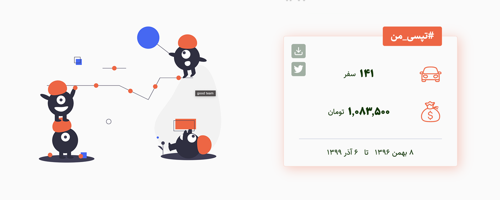
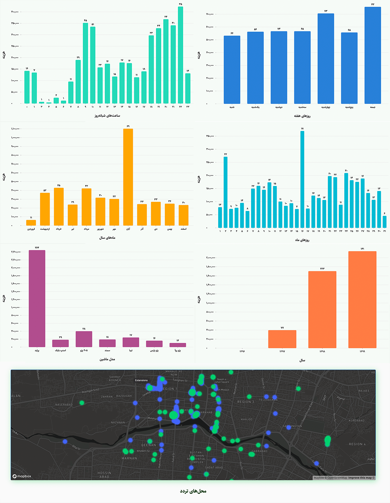
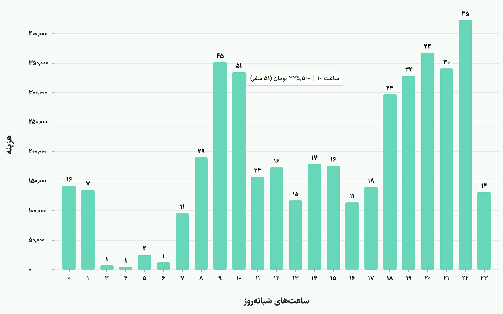
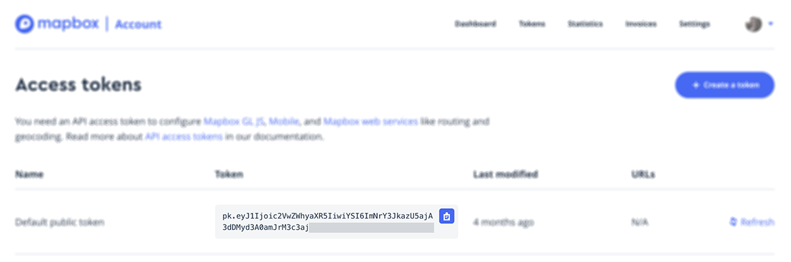

# My Tapsi Chrome Extension

**This is a forked repo from [My Sanpp Extension][mysnappextension]**.

Getting your rides history from [Tapsi application][tapsipwa].




Note: you can see count and price of each bar chart on hover:



# What is Tapsi?

You can think of [Iranian version of Uber][tapsiwiki]. Their public repository is available in [here][tapsirepo].

# How the Extension Works?

1. After installing the extension you need to sign in into your Tapsi account.
2. When you open [https://app.tapsi.cab][tapsipwa] page a script injects into the HTML `body`.
3. The script read `access-token` from the page and create a new `CustomEvent` with `access-token` and dispatched by `window`.
4. In `contentscript` we listen to the upcoming event message from the injected script. After getting the message, we save `access-token` by using [chrome.storage][chromestorage] API.
5. Every time you click on MyTapsi extension's icon we read `access-token` from `chrome.storage` and then set a state in the mounted React component (popup).
6. Now we have `access-token` as a state in our component. When you click on `Let's Go` button, the App is going request to Tapsi API with your `access-token`
7. After your data received from Tapsi API, we use `chrome.storage` for caching. And for the next time when you click on `Let's Go` button, we show your saved data.

# Privacy Policy

**All codes executed on the client-side** and the extension is only for **personal usage**. For analyzing the data we need to get your local `access-token` from the Tapsi PWA. After signing in the token will be saved in chrome storage API. You can remove the extension to destroy your `accessToken` completely.

# How to use Mapbox?

You can get your interactive Heatmap of your rides.
Based on [Mapbox documentation][mapdoc]:

> Each Mapbox API has rate limits that cap the number of requests you can make against an endpoint.

So it's better that to get our own `access-token` from Mapbox. After register and confirm your email, you can copy your Mapbox `access-token` from [here][maptoken] and add paste it into the extension.



# Contributing [WIP]

Pull requests are welcome. We can discuss what you would like to change.

# Installation [WIP]

Start: (use dist folder to install on Chrome)

```
cd my-tapsi-extension
npm ci && cd src/popup && npm ci && cd ../..
npm start
```

Build: (my-tapsi-extension.zip)

```
npm run tada
```

### Todo

- [ ] #feat porting **MyTapsi** to Safari Web Extensions [issue [#1][macosporting]]
- [ ] #feat porting **MyTapsi** to Firefox Add-ons (maybe we can use it on Android devices)

[mapdoc]: https://docs.mapbox.com/api/#rate-limits
[maptoken]: https://account.mapbox.com/access-tokens
[tapsipwa]: https://app.tapsi.cab
[tapsiwiki]: https://fa.wikipedia.org/wiki/%D8%AA%D9%BE%D8%B3%DB%8C
[tapsirepo]: https://github.com/Tap30
[chromestorage]: https://developer.chrome.com/extensions/storage
[mysnappextension]: https://github.com/sepehrity/my-snapp-extension
